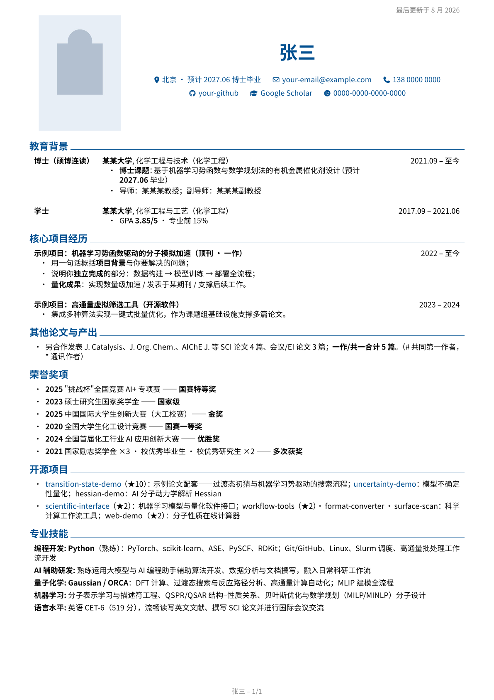

# RenderCV Studio

中文简历模板与 YAML 实时编辑工作台

基于 [RenderCV](https://github.com/rendercv/rendercv) 官方 `ClassicTheme` 示例的中文简历项目：**用清晰的 YAML 写内容，自动排版出高质量 A4 PDF**。

当前版本：`v0.1.1`

内容与样式完全分离。你只需要编辑 `examples/*.yaml` 里的文字，运行一条命令即可得到排版精良的 PDF；也可以启动内置网页端口，在浏览器左侧编辑 YAML、右侧查看真实 RenderCV PDF 预览。



## ✨ 特性

- **YAML 即简历**：不碰任何排版代码，改文字就能换内容
- **A4 + 中文字体**：默认适配 Noto Sans CJK SC / 思源黑体，支持照片、FontAwesome 联系方式图标
- **一页 / 两页双版本**：`examples/` 提供紧凑一页版与详细两页版两套样例
- **学术友好**：内置论文（PublicationEntry）区块，支持 "Doe, J." 作者缩写格式与贡献说明
- **网页实时编辑**：CodeMirror YAML 编辑器 + 本机 RenderCV PDF/PNG 预览，支持保存、下载和自动渲染
- **一键批量渲染**：PDF / PNG / Markdown / HTML 同时输出
- **CI 自动渲染**：推送后 GitHub Actions 自动生成 PDF（见 `.github/workflows/render.yml`）

## 🚀 快速开始

```bash
# 1. 安装 RenderCV（需要 Python ≥ 3.10）
uv tool install "rendercv[full]>=2.8,<2.9"
# 或: pip install "rendercv[full]"

# 2. 复制示例并改成你的内容
cp examples/resume_one_page.yaml 我的简历.yaml
$EDITOR 我的简历.yaml

# 3. 渲染 PDF（同时输出 Typst/PNG/Markdown/HTML）
rendercv render 我的简历.yaml

# 4. 实时预览：保存 YAML 后自动重新渲染
rendercv render 我的简历.yaml --watch
```

## 网页实时编辑器

这是本项目的核心工具：它不是模拟排版，而是把浏览器里的 YAML 内容交给本机 RenderCV 渲染，因此右侧预览与最终 PDF 一致。

```bash
# 在项目根目录执行
python tools/yaml_studio.py --root examples

# 浏览器打开
# http://127.0.0.1:8642
```

功能包括：

- 左侧 YAML 语法高亮、行号、折叠和可读的等宽排版；
- 右侧真实 PDF 预览，也可以切换为逐页 PNG 预览；
- 一页版 / 两页版文件切换；
- 自动渲染、手动渲染、保存 YAML、下载 YAML、下载 PDF；
- YAML 语法错误或 RenderCV 校验错误直接显示在页面中；
- 浏览器草稿自动保存，关闭页面后可以继续编辑；
- 仅监听 `127.0.0.1`，默认不会把简历内容暴露到局域网。

编辑真实简历时，把 `--root` 指向包含 YAML 和 `assets/` 的目录：

```bash
python tools/yaml_studio.py --root ../my-resume/rendercv
```

Windows PowerShell：

```powershell
.\scripts\start_studio.ps1
```

如果希望使用桌面编辑器，官方 YAML Schema 已写在文件第一行；VS Code 安装 YAML 插件后可以获得字段提示和校验。

本项目的版式基准是 RenderCV 官方示例 [`John_Doe_ClassicTheme_CV.yaml`](https://github.com/rendercv/rendercv/blob/main/examples/John_Doe_ClassicTheme_CV.yaml)。示例中的 `design.theme: classic`、四段式 YAML 结构和设计注释均保持官方用法；中文项目只额外覆盖 A4 页面和 CJK 字体。

或直接使用脚本：

```bash
./scripts/build.sh                 # 渲染 examples/ 下全部 YAML
rendercv render examples/resume_one_page.yaml
```

## 📝 编辑指南

一份 YAML 分四部分，日常只需要动 `cv:`：

```yaml
cv:
  name: 张三                        # 姓名
  location: 城市 · 预计毕业时间      # 显示在姓名下方
  email: your-email@example.com
  phone: "+8613800000000"           # 必须带国际区号（E.164 格式）
  photo: assets/photo.jpg           # 证件照
  social_networks:
    - network: GitHub
      username: your-github
    - network: Google Scholar       # username 填 scholar user id
      username: your-scholar-id
    - network: ORCID
      username: "0000-0000-0000-0000"
  sections:
    教育背景: []                     # 区块标题随意起名，顺序即渲染顺序
    核心项目经历: []
    代表性学术成果: []
    专业技能: []

design:   # 颜色/字体/间距/版式 —— 一般不用改
locale:   # 语言目录 —— 已配置为 mandarin_chinese
settings: # 行为设置 —— 如 current_date
```

### 常用修改

| 想做什么 | 改哪里 |
|---|---|
| 换主题色 | `design.colors.section_titles` / `links` |
| 字体大小 | `design.typography.font_size.body` |
| 页边距 | `design.page.*_margin` |
| 照片大小 | `design.header.photo_width` |
| 增删区块 | `cv.sections` 直接增删键值 |
| 自动加粗关键词 | `settings.bold_keywords: [PyTorch, ...]` |

### 条目类型速查

```yaml
# 论文（同一区块内条目类型必须一致！）
- title: Paper Title
  authors: ["Smith, A.#", "*Doe, J.*#（共一）", "Lee, R.*"]   # *斜体* 高亮本人
  journal: "Example Journal（顶刊 · 共一）"
  date: "2026 年"                    # 加"年"避免被解析为日期格式化成"1 月 2026"
  summary: "**贡献**：负责 MLIP 建模。"

# 经历 / 项目
- name: 项目名
  date: "2022 – 至今"                # 自由文本日期最省心
  highlights:
    - "要点支持 **Markdown 加粗** 和 [链接](https://github.com)"

# 技能
- label: 编程开发
  details: Python, PyTorch, ...

# 纯 bullet
- bullet: "**2025** 某竞赛 —— **特等奖**"
```

### ⚠️ 注意事项

1. **含英文冒号 `:` 的字符串必须加引号**（全角 `：` 不需要），否则 YAML 解析报错；
2. **同一 section 内不要混用条目类型**（如论文列表里插一条 bullet 会校验失败），单独建一个小节即可；
3. 手机号必须写成 `+86...` 国际格式；
4. 论文 `date` 若只写年份请加"年"字，否则会被格式化为 "1 月 2026"；
5. 中文渲染依赖系统字体 `Noto Sans CJK SC`（Linux 安装：`sudo apt install fonts-noto-cjk`；Windows 用户可在 `design.typography.font_family` 改为 `Microsoft YaHei`）；
6. 网页编辑器默认只监听 `127.0.0.1`；如需局域网访问，请明确传入 `--host`，并自行评估隐私风险。

## 📦 发布你自己的简历

```bash
git init && git add . && git commit -m "my resume"
git push origin main        # GitHub Actions 会自动渲染并上传 PDF Artifacts
```

本仓库的 GitHub Actions 会安装中文字体、渲染 `examples/` 下全部 YAML，并上传 PDF/PNG 构建产物。个人简历建议把真实照片和个人信息放在私有仓库；公开发布时使用占位头像和示例身份。

首次发布项目：

```bash
gh repo create rendercv-studio --public --source=. --remote=origin --push
gh release create v0.1.1 --title "v0.1.1 - RenderCV Studio" --generate-notes
```

## 📄 License

MIT — 随意使用、修改、分发。求职顺利！

## 致谢

- [RenderCV](https://github.com/rendercv/rendercv) — 强大的声明式简历引擎
- [Noto Sans CJK](https://fonts.google.com/noto) — 开源中文字体
